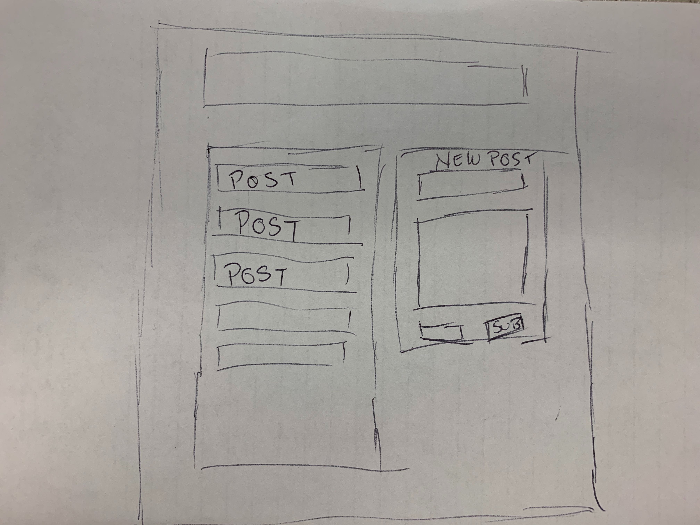

# Conspiricy Blog

Team Members:
 Elise Hammons, Bailey Beck,
Fauz Ahmed, Gordon Coutret

Project Description: 

This application will serve as a safe space for like-minded enlightened thinkers to spew their garbage about the hidden truths that permeate our lives. 
Those who fail to see clearly through the dubious illusions created by the government, big industry, and other shadow syndicates, will often refer to these truths as "conspiracies". Free from the shackles and judgement of those who doubt, ________ is here to open the eyes of those who's eyes are already open. 

Technologies:
mySQL
node.js
express
handlebars
sequelize
User Authentication

Sketch:

Api:

Users will be able to upload articles to the databse. Each submition will create a post that will link to a message board where users can access the article and post comments. 